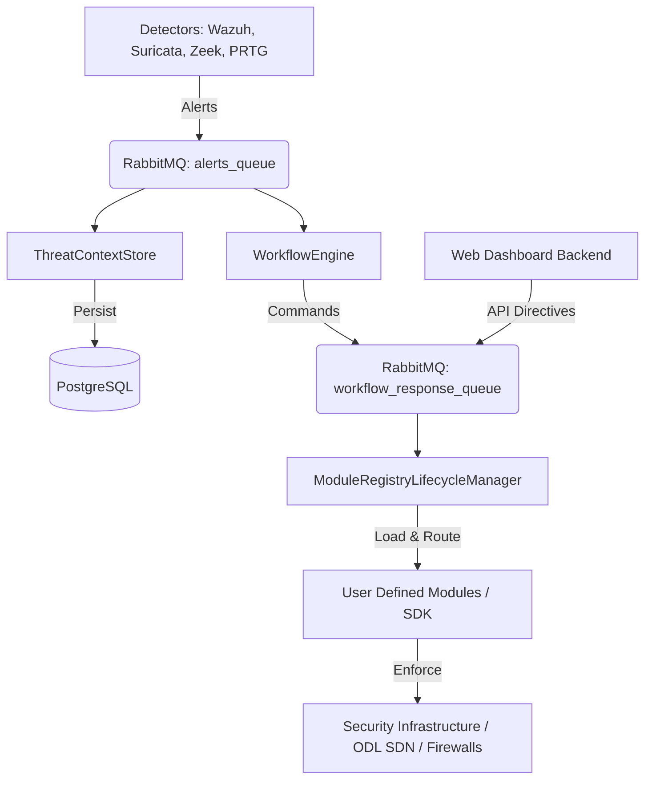

# Rebuilding the Middleware SOAR Platform

This guide serves as a blueprint for rebuilding or setting up the **Middleware (SOAR Framework)** from scratch. The system is designed to allow Security Operations Center (SOC) analysts to dynamically create response modules for their existing security tools and write workflows (YAML playbooks) to automate security defenses.

---

## 🏗️ Architecture & Flow Overview

The platform uses an event-driven microservices architecture communicating over **RabbitMQ** and storing data in **PostgreSQL**:



### Core Components

1. **[nis-thesis-sdk](file:///C:/Users/keanl/Documents/GitHub/Middleware/nis-thesis-sdk)**: The core shared SDK containing base API definitions (`CoreSystemApi`, `ModuleHelper`), telemetry interfaces, and event models.
2. **[user-defined-modules](file:///C:/Users/keanl/Documents/GitHub/Middleware/user-defined-modules)**: Implementations of custom security connectors (e.g. OpenDaylight Module, Suricata Module, Zeek, PRTG).
3. **[ModuleRegistryLifecycleManager](file:///C:/Users/keanl/Documents/GitHub/Middleware/ModuleRegistryLifecycleManager)**: Manages registering, loading, and dynamically dispatching actions to user-defined modules.
4. **[ThreatContextStore](file:///C:/Users/keanl/Documents/GitHub/Middleware/ThreatContextStore)**: Consumes raw alerts from `alerts_queue` and logs them to PostgreSQL for historical auditing and correlation.
5. **[WorkflowEngine](file:///C:/Users/keanl/Documents/GitHub/Middleware/WorkflowEngine)**: Watches security alerts, matches them against YAML-defined playbooks, evaluates conditions, and generates action directives.

---

## 🛠️ Prerequisites

Ensure the following are installed and running locally:
- **Java JDK**: Version 17+ (Java 21 recommended for the SDK).
- **Maven**: Version 3.8+.
- **RabbitMQ**: Message broker for handling `alerts_queue` and `workflow_response_queue`.
- **PostgreSQL**: Databases for storing alerts (`threat_context_store`) and registered modules (`module_registry`).

---

## 🚀 Step-by-Step Reconstruction

### Step 1: Initialize Database Schema

1. Create a PostgreSQL database (e.g., `threat_context_store`).
2. Apply the schema for the storage store:
   ```bash
   cd ThreatContextStore
   psql -h localhost -U <username> -d <dbname> -f schema.sql
   psql -h localhost -U <username> -d <dbname> -f migration_add_query_columns.sql
   ```
3. Set up the schema for registered modules:
   ```bash
   cd ../ModuleRegistryLifecycleManager
   psql -h localhost -U <username> -d <dbname> -f schema_registered_modules.sql
   ```

### Step 2: Configure System Properties

Each component references its own `config.properties` file:
* **ThreatContextStore**: Copy `config.properties.example` to `config.properties` and edit the database/RabbitMQ credentials.
* **ModuleRegistryLifecycleManager**: Verify `config.properties` matches your local RabbitMQ setup.
* **WorkflowEngine**: Verify `config.properties` settings.

### Step 3: Build & Compile Order

> [!IMPORTANT]
> The build system is hybrid. **SDK and User Modules** use Maven. **ThreatContextStore and WorkflowEngine** are compiled directly via `javac` to support direct classpath execution.

1. **Build the Shared SDK**:
   ```bash
   cd nis-thesis-sdk
   mvn clean install
   ```

2. **Build User-Defined Modules**:
   ```bash
   cd ../user-defined-modules
   mvn clean install
   ```

3. **Compile ThreatContextStore**:
   ```bash
   cd ../ThreatContextStore
   # Windows (PowerShell/Cmd)
   javac -cp "lib/*;target/classes" -d target/classes src/main/java/com/yourorg/middleware/*.java
   # Linux/macOS
   # javac -cp "lib/*:target/classes" -d target/classes src/main/java/com/yourorg/middleware/*.java
   ```

4. **Compile WorkflowEngine**:
   ```bash
   cd ../WorkflowEngine
   # Windows (PowerShell/Cmd)
   javac -cp "lib/*;target/classes" -d target/classes src/main/java/com/yourorg/workflow/*.java
   # Linux/macOS
   # javac -cp "lib/*:target/classes" -d target/classes src/main/java/com/yourorg/workflow/*.java
   ```

---

## 🏃 Execution Order

To bring the SOAR pipeline up:

1. **Start RabbitMQ and PostgreSQL** servers.
2. **Start ThreatContextStore** (Ingester):
   ```bash
   cd ThreatContextStore
   java -cp "target/classes;lib/*" com.yourorg.middleware.ThreatContextStoreMain
   ```
3. **Start WorkflowEngine** (Playbook Evaluator):
   ```bash
   cd WorkflowEngine
   java -cp "target/classes;lib/*" com.yourorg.workflow.WorkflowEngineMain
   ```
4. **Start ModuleRegistryLifecycleManager** (Enforcer Module Host):
   ```bash
   cd ModuleRegistryLifecycleManager
   java -cp "target/classes;lib/*" com.nis1.thesis.mrlm.ModuleRegistryLifecycleManagerMain
   ```
5. *(Optional)* **Start the Web Dashboard**:
   ```bash
   cd webapp/backend
   npm install && npm start
   cd ../frontend
   npm install && npm start
   ```

---

## 🛡️ Guide for SOC Analysts

This platform allows SOC analysts to easily extend automated defenses based on available tools.

### 1. Creating a User-Defined Module
If a new tool (e.g., an external firewall or endpoint agent) is added:
1. Implement a new class inside `user-defined-modules` implementing the SDK base interfaces.
2. Annotate or declare it so the `ModuleRegistry` can detect it.
3. Repackage using `mvn clean install` and register it inside the module registry database.

### 2. Crafting Response Workflows
Workflows are defined in YAML playbooks located under `WorkflowEngine/workflows/ransomware/`. They map alert triggers to action targets.

Example Playbook structure:
```yaml
name: "Suricata Ransomware Defense"
trigger:
  event_type: "ransomware_alert"
  severity: "high"
condition:
  expression: "alert.contains('encryption_activity')"
actions:
  - name: "Isolate Host"
    module: "OpenDaylightModule"
    parameters:
      action: "block"
      target_ip: "${alert.source_ip}"
```

Analysts can write and save these playbooks in the directory, and the `WorkflowEngine` dynamically reloads and executes them when matching alerts are received via `alerts_queue`.
